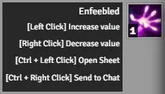

# FoundryVTT PF2e Effect Description

This module simply adds additional clicking options for the `Effects Panel` (top right of the screen):

-   `[Shift + Right Click]` will remove the effect entirely (skipping all the counters if any).

-   `[Ctrl + Left Click]` will open the effect sheet, where the description and other options are available.

# Settings

Users can enable each option individually in the settings.

# CHANGELOG

You can see the changelog [HERE](./CHANGELOG.md)
